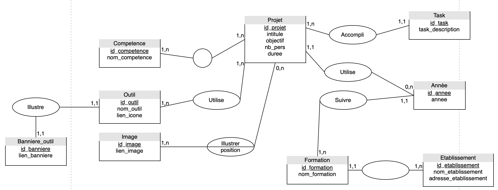
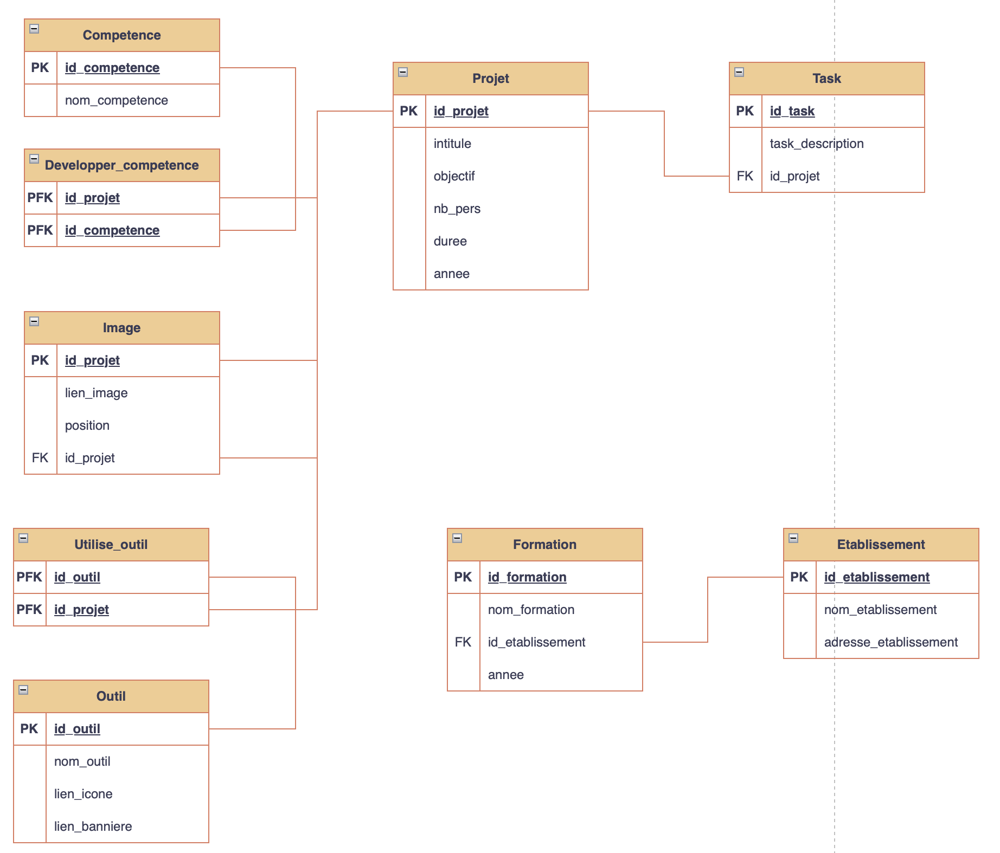

## Database of this portfolio

### How to use ? 

I've used PostgreSQL, so this scripts can contains some specific postgres instructions. 
To create the tables, you can execute ``tableCreate.sql`` file. 
To populate that tables, you have to lauch the ``tablePopulate.sql`` script.

### How this database is made ? 

Here the Entity Relationship Diagram (Modèle Entité Association in french) :

For the logical part, here that diagram (Modèle relationnel in french) : 

It's the second one which is implemented in SQL. 